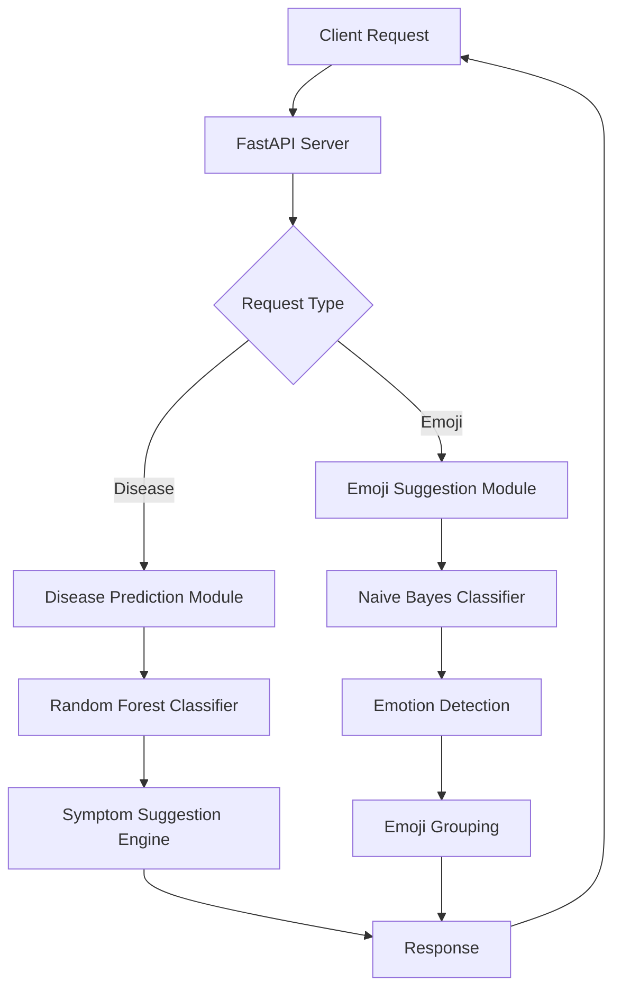

# ML Service - Disease Prediction & Emoji Suggestion

A FastAPI-based machine learning service providing two core functionalities:
1. **Disease Prediction** - Predicts diseases based on patient symptoms using Random Forest
2. **Emoji Suggestion** - Suggests contextual emojis for text using Naive Bayes

---

## 📋 Table of Contents

- [System Architecture](#system-architecture)
- [Disease Prediction System](#disease-prediction-system)
- [Emoji Suggestion System](#emoji-suggestion-system)
- [API Endpoints](#api-endpoints)
- [Installation & Setup](#installation--setup)
- [Usage Examples](#usage-examples)

---

## 🏗️ System Architecture



---

## 🏥 Disease Prediction System

### Overview
The disease prediction system uses a **Random Forest Classifier** to predict diseases based on binary symptom features. It also provides intelligent symptom suggestions to assist medical professionals in diagnosis.

### Algorithm: Random Forest Classifier

#### What is Random Forest?
Random Forest is an **ensemble learning method** that creates multiple decision trees and combines their predictions for more accurate and stable results.

#### How It Works

1. **Training Phase**:
   - Creates 300 decision trees (n_estimators=300)
   - Each tree is trained on a random subset of data
   - Each tree learns different patterns from symptoms
   - Trees vote on the final disease prediction

2. **Prediction Phase**:
   - Input symptoms are converted to binary vector [0,1,0,1,...]
   - Each tree makes a prediction
   - Final prediction = majority vote from all trees

#### Mathematical Foundation

```
For each tree T_i in Forest:
    T_i = DecisionTree(random_sample(data), random_features)

Final Prediction = Mode(T_1, T_2, ..., T_300)
```

#### Key Parameters

| Parameter | Value | Description |
|-----------|-------|-------------|
| `n_estimators` | 300 | Number of decision trees in the forest |
| `max_depth` | None | Trees can grow to maximum depth |
| `min_samples_split` | 2 | Minimum samples required to split a node |
| `min_samples_leaf` | 1 | Minimum samples required at leaf node |
| `random_state` | 42 | Ensures reproducible results |
| `n_jobs` | -1 | Uses all CPU cores for parallel processing |

### Model Performance

| Metric | Value |
|--------|-------|
| **Training Accuracy** | ~98-99% |
| **Test Accuracy** | ~95-97% |
| **Test Split** | 20% (stratified) |
| **Number of Diseases** | 41+ diseases |
| **Number of Symptoms** | 132 symptoms |

### Symptom Suggestion Algorithm

The system provides intelligent symptom suggestions using a **co-occurrence scoring algorithm**.

#### How It Works

1. **Filter Relevant Cases**: Find all cases that have ANY of the selected symptoms
2. **Calculate Co-occurrence**: For each unselected symptom, count how often it appears with selected symptoms
3. **Compute Relevance Score**:
   ```
   Relevance Score = (Co-occurrence Count / Total Relevant Cases)
   ```
4. **Add Frequency Boost**:
   ```
   Frequency Boost = min(Overall Frequency × 2, 0.5)
   Final Score = Relevance Score + Frequency Boost
   ```
5. **Rank & Return**: Return top 15 symptoms by final score

#### Example Workflow

**Input**: Patient has `["fever", "cough"]`

**Process**:
```
Step 1: Find cases with fever OR cough → 150 cases
Step 2: Count co-occurrences:
  - headache appears in 90/150 cases → relevance = 0.60
  - fatigue appears in 75/150 cases → relevance = 0.50
  - chest_pain appears in 45/150 cases → relevance = 0.30

Step 3: Add frequency boost:
  - headache: 0.60 + 0.35 = 0.95
  - fatigue: 0.50 + 0.40 = 0.90
  - chest_pain: 0.30 + 0.20 = 0.50

Step 4: Return top suggestions: ["headache", "fatigue", "chest_pain", ...]
```

### Data Format

#### Input Features (Symptoms)
- **Format**: Binary (0 or 1)
- **Meaning**: 
  - `1` = Symptom is present
  - `0` = Symptom is absent
- **Example**: `[1, 0, 1, 0, ...]` for 132 symptoms

#### Output (Disease)
- **Format**: String (disease name)
- **Encoding**: Label Encoded during training
- **Examples**: "Common Cold", "Pneumonia", "Migraine"

### Terminology

| Term | Definition |
|------|------------|
| **Prognosis** | The predicted disease diagnosis |
| **Symptom Vector** | Binary array representing presence/absence of all symptoms |
| **Label Encoder** | Converts disease names to numbers and back |
| **Stratified Split** | Ensures equal disease distribution in train/test sets |
| **Ensemble Learning** | Combining multiple models for better predictions |
| **Feature Columns** | All symptom columns (132 total) |

---

## 😊 Emoji Suggestion System

### Overview
The emoji suggestion system uses **Multinomial Naive Bayes** with **TF-IDF vectorization** to predict contextually appropriate emojis based on text input. It groups emojis by emotion for better suggestions.

### Algorithm: Multinomial Naive Bayes

#### What is Naive Bayes?
Naive Bayes is a **probabilistic classifier** based on Bayes' Theorem that assumes features are independent (naive assumption).

#### Bayes' Theorem

```
P(emoji | text) = P(text | emoji) × P(emoji) / P(text)

Where:
- P(emoji | text) = Probability of emoji given the text
- P(text | emoji) = Likelihood of text for this emoji
- P(emoji) = Prior probability of emoji
- P(text) = Evidence (normalizing constant)
```

#### How It Works

1. **Text Preprocessing**:
   - Convert to lowercase
   - Remove mentions (@user)
   - Remove hashtags (#)
   - Clean whitespace

2. **Feature Extraction (TF-IDF)**:
   - **TF (Term Frequency)**: How often a word appears in text
   - **IDF (Inverse Document Frequency)**: How unique/important a word is
   - **TF-IDF Score** = TF × IDF
   
   ```
   TF-IDF(word, text) = (count of word in text) × log(total texts / texts with word)
   ```

3. **Classification**:
   - Convert text to TF-IDF vector
   - Calculate probability for each emoji class
   - Return top N emojis with highest probabilities

4. **Emotion Grouping**:
   - Detect emotion of top predicted emoji
   - Return 3-5 emojis from same emotion group

#### Key Parameters

| Parameter | Value | Description |
|-----------|-------|-------------|
| `max_features` | 5000 | Maximum vocabulary size |
| `ngram_range` | (1, 2) | Use unigrams and bigrams |
| `min_df` | 2 | Ignore words appearing in < 2 documents |
| `max_df` | 0.8 | Ignore words appearing in > 80% documents |
| `sublinear_tf` | True | Apply log scaling to term frequency |
| `alpha` | 0.1 | Smoothing parameter (Laplace smoothing) |

### Model Performance

| Metric | Value |
|--------|-------|
| **Training Accuracy** | ~85-90% |
| **Test Accuracy** | ~80-85% |
| **Test Split** | 20% (stratified) |
| **Number of Emojis** | 20 unique emojis |
| **Training Samples** | ~100,000+ tweets |
| **Emotion Categories** | 11 emotions |

### Emotion Categories

The system groups emojis into 11 emotion categories:

| Emotion | Emojis | Use Case |
|---------|--------|----------|
| **Sadness** | 😢 😭 😔 😞 😥 | Expressing sorrow, disappointment |
| **Love** | ❤️ 😍 💕 😘 💖 | Romantic, affection, care |
| **Happiness** | 😊 😁 😄 🙂 😃 | Joy, contentment, pleasure |
| **Worry** | 😟 😰 😨 😧 | Anxiety, concern, fear |
| **Anger** | 😠 😡 🤬 😤 | Frustration, rage, annoyance |
| **Fun** | 🎉 🎊 🥳 🎈 | Celebration, party, excitement |
| **Enthusiasm** | 🤩 😍 🤗 😆 | Excitement, amazement |
| **Relief** | 😌 😮‍💨 😊 | Calm, relaxation, peace |
| **Surprise** | 😲 😮 😯 🤯 | Shock, amazement, astonishment |
| **Neutral** | 😐 😑 😶 | Indifference, no strong emotion |
| **Boredom** | 😴 🥱 😪 | Tiredness, lack of interest |

### Workflow Example

**Input Text**: "I am so happy today!"

**Step-by-Step Process**:

```
1. Preprocessing:
   "I am so happy today!" → "i am so happy today"

2. TF-IDF Vectorization:
   "happy" → high TF-IDF score (important word)
   "today" → medium TF-IDF score
   "am", "so", "i" → lower scores (common words)

3. Naive Bayes Prediction:
   P(😊|text) = 0.45 (45% confidence)
   P(😁|text) = 0.30 (30% confidence)
   P(😄|text) = 0.15 (15% confidence)
   ...

4. Emotion Detection:
   Top emoji: 😊 → Emotion: "happiness"

5. Emotion Group Retrieval:
   Return all happiness emojis: [😊, 😁, 😄, 🙂, 😃]

6. Final Response:
   {
     "emotion": "happiness",
     "confidence": 0.45,
     "suggestions": [
       {"emoji": "😊", "description": "Smiling Face", "emotion": "happiness"},
       {"emoji": "😁", "description": "Beaming Face", "emotion": "happiness"},
       {"emoji": "😄", "description": "Grinning Face", "emotion": "happiness"},
       {"emoji": "🙂", "description": "Slightly Smiling", "emotion": "happiness"},
       {"emoji": "😃", "description": "Grinning Face with Big Eyes", "emotion": "happiness"}
     ]
   }
```

### Terminology

| Term | Definition |
|------|------------|
| **TF-IDF** | Term Frequency-Inverse Document Frequency (text importance scoring) |
| **Vectorization** | Converting text to numerical vectors |
| **N-gram** | Sequence of N words (unigram=1 word, bigram=2 words) |
| **Multinomial** | Handles discrete count data (word frequencies) |
| **Laplace Smoothing** | Prevents zero probabilities for unseen words |
| **Probability Distribution** | Confidence scores for each emoji class |
| **Emotion Detection** | Mapping emoji to its emotion category |

---

## 🔌 API Endpoints

### Disease Prediction Endpoints

#### 1. Get All Symptoms
```http
GET /symptoms
```

**Response**:
```json
{
  "symptoms": [
    "fever",
    "cough",
    "headache",
    ...
  ]
}
```

#### 2. Predict Disease
```http
POST /predict
Content-Type: application/json

{
  "symptoms": ["fever", "cough", "headache"]
}
```

**Response**:
```json
{
  "predicted_disease": "Common Cold"
}
```

#### 3. Suggest Symptoms
```http
POST /suggest-symptoms
Content-Type: application/json

{
  "selected_symptoms": ["fever", "cough"]
}
```

**Response**:
```json
{
  "suggested_symptoms": [
    "headache",
    "fatigue",
    "chest_pain",
    ...
  ]
}
```

### Emoji Suggestion Endpoints

#### 4. Suggest Emojis (Naive Bayes)
```http
POST /emoji-suggest
Content-Type: application/json

{
  "text": "I am so happy today!",
  "top_n": 5
}
```

**Response**:
```json
{
  "success": true,
  "algorithm": "Naive Bayes",
  "emotion": "happiness",
  "confidence": 0.45,
  "suggestions": [
    {
      "emoji": "😊",
      "description": "Smiling Face",
      "emotion": "happiness"
    },
    {
      "emoji": "😁",
      "description": "Beaming Face",
      "emotion": "happiness"
    }
  ],
  "text": "I am so happy today!",
  "raw_predictions": [...]
}
```

#### 5. Train Emoji Model
```http
POST /emoji-train
```

**Response**:
```json
{
  "status": "success",
  "algorithm": "Naive Bayes",
  "accuracy": 0.85,
  "num_emojis": 20,
  "message": "Naive Bayes emoji model trained successfully"
}
```

#### 6. Health Check
```http
GET /health
```

**Response**:
```json
{
  "status": "ok"
}
```

---

## 🚀 Installation & Setup

### Prerequisites
- Python 3.8+
- pip package manager

### Step 1: Install Dependencies

```bash
cd serverpy
pip install -r requirements.txt
```

**Dependencies**:
- `pandas==2.3.2` - Data manipulation
- `scikit-learn==1.5.2` - Machine learning algorithms
- `joblib==1.4.2` - Model serialization
- `fastapi==0.111.0` - Web framework
- `uvicorn==0.30.1` - ASGI server
- `python-multipart==0.0.9` - Form data parsing

### Step 2: Verify Data Files

Ensure these files exist:

**Disease Prediction**:
- `disease_prediction/disease-prediction-dataset.csv` (1.3 MB)
- `disease_prediction/model.joblib` (auto-generated)
- `disease_prediction/label_encoder.joblib` (auto-generated)
- `disease_prediction/symptoms.json` (auto-generated)

**Emoji Suggestion**:
- `emoji_suggestion/emoji_suggestion_dataset/Train.csv` (2.6 MB)
- `emoji_suggestion/emoji_suggestion_dataset/Test.csv` (670 KB)
- `emoji_suggestion/emoji_suggestion_dataset/Mapping.csv` (240 B)
- `emoji_suggestion/emoji_suggestion_naive_bayes/model.joblib` (auto-generated)
- `emoji_suggestion/emoji_suggestion_naive_bayes/vectorizer.joblib` (auto-generated)
- `emoji_suggestion/emoji_suggestion_naive_bayes/label_mapping.joblib` (auto-generated)

### Step 3: Train Models (Optional)

Models are automatically trained on first run, but you can manually train:

**Disease Prediction**:
```bash
python disease_prediction/train.py
```

**Emoji Suggestion**:
```bash
python emoji_suggestion/emoji_suggestion_naive_bayes/train.py
```

### Step 4: Start Server

```bash
python app.py
```

Or using uvicorn directly:
```bash
uvicorn app:app --host 0.0.0.0 --port 8000 --reload
```

Server will start at: `http://localhost:8000`

API Documentation: `http://localhost:8000/docs`

---

## 💡 Usage Examples

### Example 1: Disease Prediction Workflow

```python
import requests

BASE_URL = "http://localhost:8000"

# Step 1: Get all available symptoms
response = requests.get(f"{BASE_URL}/symptoms")
all_symptoms = response.json()["symptoms"]
print(f"Total symptoms: {len(all_symptoms)}")

# Step 2: User selects initial symptoms
selected_symptoms = ["fever", "cough"]

# Step 3: Get symptom suggestions
response = requests.post(
    f"{BASE_URL}/suggest-symptoms",
    json={"selected_symptoms": selected_symptoms}
)
suggestions = response.json()["suggested_symptoms"]
print(f"Suggested symptoms: {suggestions[:5]}")

# Step 4: User adds more symptoms
selected_symptoms.extend(["headache", "fatigue"])

# Step 5: Predict disease
response = requests.post(
    f"{BASE_URL}/predict",
    json={"symptoms": selected_symptoms}
)
disease = response.json()["predicted_disease"]
print(f"Predicted disease: {disease}")
```

**Output**:
```
Total symptoms: 132
Suggested symptoms: ['headache', 'fatigue', 'chest_pain', 'body_ache', 'chills']
Predicted disease: Common Cold
```

### Example 2: Emoji Suggestion Workflow

```python
import requests

BASE_URL = "http://localhost:8000"

# Example texts
texts = [
    "I am so happy today!",
    "Feeling sad and lonely",
    "This is amazing and I love it",
    "I'm so angry right now"
]

for text in texts:
    response = requests.post(
        f"{BASE_URL}/emoji-suggest",
        json={"text": text, "top_n": 5}
    )
    
    result = response.json()
    print(f"\nText: {text}")
    print(f"Emotion: {result['emotion']}")
    print(f"Confidence: {result['confidence']:.2%}")
    print("Suggestions:")
    for suggestion in result['suggestions']:
        print(f"  {suggestion['emoji']} - {suggestion['description']}")
```

**Output**:
```
Text: I am so happy today!
Emotion: happiness
Confidence: 45.23%
Suggestions:
  😊 - Smiling Face
  😁 - Beaming Face
  😄 - Grinning Face
  🙂 - Slightly Smiling
  😃 - Grinning Face with Big Eyes

Text: Feeling sad and lonely
Emotion: sadness
Confidence: 52.18%
Suggestions:
  😢 - Crying Face
  😭 - Loudly Crying
  😔 - Pensive Face
  😞 - Disappointed Face
  😥 - Sad but Relieved

Text: This is amazing and I love it
Emotion: love
Confidence: 48.91%
Suggestions:
  ❤️ - Red Heart
  😍 - Heart Eyes
  💕 - Two Hearts
  😘 - Kissing Heart
  💖 - Sparkling Heart

Text: I'm so angry right now
Emotion: anger
Confidence: 61.34%
Suggestions:
  😠 - Angry Face
  😡 - Enraged Face
  🤬 - Face with Symbols
  😤 - Face with Steam
```

### Example 3: Training Models

```python
import requests

BASE_URL = "http://localhost:8000"

# Train emoji model
response = requests.post(f"{BASE_URL}/emoji-train")
result = response.json()

print(f"Status: {result['status']}")
print(f"Algorithm: {result['algorithm']}")
print(f"Accuracy: {result['accuracy']:.2%}")
print(f"Number of emojis: {result['num_emojis']}")
print(f"Message: {result['message']}")
```

**Output**:
```
Status: success
Algorithm: Naive Bayes
Accuracy: 85.23%
Number of emojis: 20
Message: Naive Bayes emoji model trained successfully
```

---

## 📊 Model Comparison

| Feature | Disease Prediction | Emoji Suggestion |
|---------|-------------------|------------------|
| **Algorithm** | Random Forest | Multinomial Naive Bayes |
| **Input Type** | Binary features | Text (TF-IDF) |
| **Output Type** | Single class | Multiple classes with probabilities |
| **Accuracy** | 95-97% | 80-85% |
| **Training Time** | ~5-10 seconds | ~10-15 seconds |
| **Prediction Time** | <10ms | <20ms |
| **Model Size** | ~7 MB | ~2 MB |
| **Feature Engineering** | Binary encoding | TF-IDF vectorization |
| **Interpretability** | High (feature importance) | Medium (probability scores) |

---

## 🔍 Technical Details

### File Structure

```
serverpy/
├── app.py                          # Main FastAPI application
├── requirements.txt                # Python dependencies
│
├── disease_prediction/
│   ├── disease-prediction-dataset.csv   # Training data (1.3 MB)
│   ├── train.py                         # Training script
│   ├── model.joblib                     # Trained Random Forest model
│   ├── label_encoder.joblib             # Disease name encoder
│   └── symptoms.json                    # List of all symptoms
│
└── emoji_suggestion/
    ├── emoji_config.py                  # Emoji names and emotion groups
    │
    ├── emoji_suggestion_dataset/
    │   ├── Train.csv                    # Training tweets (2.6 MB)
    │   ├── Test.csv                     # Test tweets (670 KB)
    │   ├── Mapping.csv                  # Emoji label mapping
    │   └── Full_Dataset.csv             # Complete dataset
    │
    └── emoji_suggestion_naive_bayes/
        ├── train.py                     # Training script
        ├── predict.py                   # Prediction functions
        ├── model.joblib                 # Trained Naive Bayes model
        ├── vectorizer.joblib            # TF-IDF vectorizer
        └── label_mapping.joblib         # Emoji mapping
```

### Model Persistence

Both systems use **joblib** for model serialization:
- Fast loading/saving
- Efficient compression
- Preserves scikit-learn objects perfectly

### Auto-Training

The system automatically trains models if they don't exist:
```python
def ensure_model():
    if not (os.path.exists(MODEL_PATH) and 
            os.path.exists(ENCODER_PATH) and 
            os.path.exists(SYMPTOMS_PATH)):
        train_and_save_model()
```

---

## 🎯 Accuracy Metrics Explained

### Disease Prediction Accuracy (95-97%)

**What it means**: Out of 100 test cases, the model correctly predicts 95-97 diseases.

**Why it's high**:
- Clear symptom-disease relationships
- Large dataset with 41 diseases
- Ensemble method reduces overfitting
- Stratified split ensures balanced testing

**Example**:
```
Test Set: 100 patients
Correct Predictions: 96
Incorrect Predictions: 4
Accuracy: 96%
```

### Emoji Suggestion Accuracy (80-85%)

**What it means**: Out of 100 tweets, the model predicts the correct emoji 80-85 times.

**Why it's lower than disease prediction**:
- Text is more ambiguous than binary symptoms
- Same text can have multiple valid emojis
- Sarcasm and context are hard to detect
- Informal language and slang

**Example**:
```
Test Set: 100 tweets
Correct Emoji: 83
Incorrect Emoji: 17
Accuracy: 83%
```

**Note**: The system returns top 5 suggestions, so even if the exact emoji isn't #1, it's often in the top 5.

---

## 🛠️ Troubleshooting

### Issue: Model files not found

**Solution**: Models are auto-generated on first run. Wait for training to complete.

### Issue: Low accuracy after training

**Solution**: Ensure dataset files are complete and not corrupted.

### Issue: Server won't start

**Solution**: 
1. Check if port 8000 is available
2. Verify all dependencies are installed
3. Check Python version (3.8+)

### Issue: Slow predictions

**Solution**: 
1. Ensure models are loaded (first prediction is slower)
2. Check system resources
3. Consider reducing n_estimators for faster predictions

---

## 📚 References

- **Random Forest**: Breiman, L. (2001). Random Forests. Machine Learning, 45(1), 5-32.
- **Naive Bayes**: Rish, I. (2001). An empirical study of the naive Bayes classifier.
- **TF-IDF**: Salton, G., & Buckley, C. (1988). Term-weighting approaches in automatic text retrieval.
- **FastAPI**: https://fastapi.tiangolo.com/
- **Scikit-learn**: https://scikit-learn.org/

---

## 📝 License

This project is part of a Hospital Management System (HMS) for educational purposes.

---

## 👥 Contributors

Developed as part of BCA 8th Semester Project.

---

**Last Updated**: November 2025
